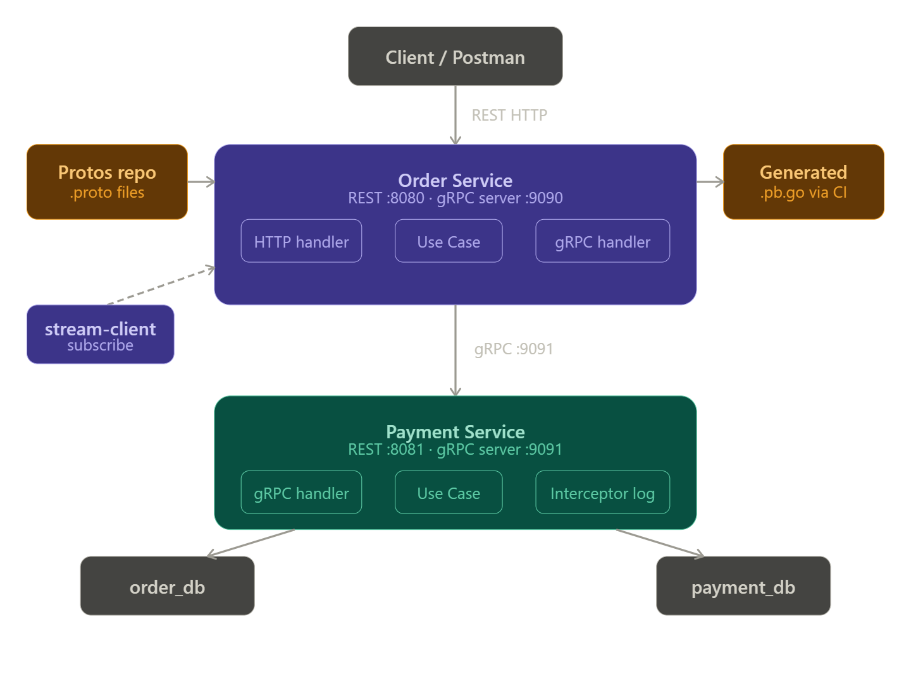

# Order-Payment Microservices

## Repositories
- Proto files: https://github.com/nureeek/Protos-order-payment-grpc
- Generated code: https://github.com/nureeek/Generated-order-payment-grpc

## Architecture
- Order Service (REST :8080, gRPC :9090)
- Payment Service (REST :8081, gRPC :9091)
- Order Service calls Payment Service via gRPC
- Order Service exposes server-side streaming for order status updates
## Architecture Diagram



### Communication Flow
- Client → Order Service: REST HTTP (:8080)
- Order Service → Payment Service: gRPC (:9091)
- stream-client → Order Service: gRPC Server-side Streaming (:9090)
- Protos repo → Generated repo: GitHub Actions auto-generation
## How to run

### Payment Service
```bash
cd paymentService
go run cmd/payment-service/main.go
```

### Order Service
```bash
cd orderService
go run cmd/order-service/main.go
```

### Test Streaming
```bash
cd orderService
go run cmd/stream-client/main.go <order_id>
```

## Environment Variables
| Variable | Default |
|----------|---------|
| PAYMENT_DB_URL | postgres://...payment_db |
| ORDER_DB_URL | postgres://...order_db |
| GRPC_PORT | 9091 |
| ORDER_GRPC_PORT | 9090 |
| PAYMENT_GRPC_ADDR | localhost:9091 |
| HTTP_PORT | 8080/8081 |